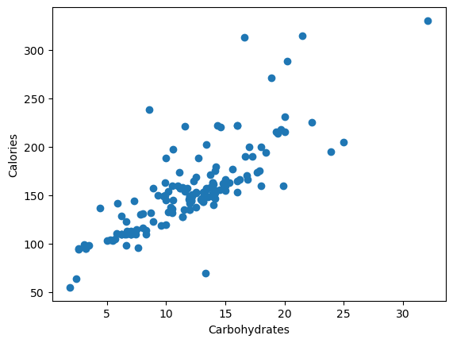
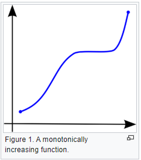
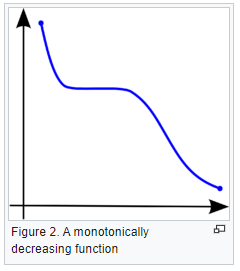
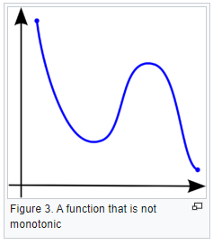
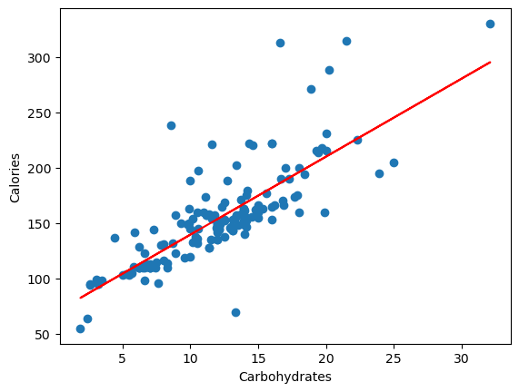

# Linear Regression


## Our Data
Practicing single linear regression on beer data set. 

## Plotting our Data
We will be trying to predict total calories with grams of Carbohydrates. 

 

## Correlation of Variables


### Understanding Pearson's R vs Spearman's Rho?

- Correlation is the degree to which two variables are linearly related. 
- Important to remember that correlation doesn't imply causation.
- Pearson's R ranges from +1 to -1
- Spearman's rank correlation coefficient is a nonparametric measure of rank correlation
    - Spearman's rho explains how well two variables can be described using a montonic function


### What is a montonic relationship?

"A monotonic relationship is a relationship that does one of the following:

(1) as the value of one variable increases, so does the value of the other variable, OR,

(2) as the value of one variable increases, the other variable value decreases.

BUT, not exactly at a constant rate whereas in a linear relationship the rate of increase/decrease is constant."

#### Example of Monotonic Relationship



```
import scipy.stats

x = df['Carbohydrates']
y = df['Calories']
scipy.stats.pearsonr(x,y)
```

**Pearson's R: .7979**

## Checking For Normality

### Quantile-Quantile Plot


**Interpret QQ Plot**

We can try normalizing the data further by applying a **log function**?

## Train-Test-Split Data
```
from sklearn.model_selection import train_test_split

x_train, x_test, y_train, y_test = train_test_split(x,y,test_size=.33,random_state=42)
```

## Create and Fit Linear Model
```
from sklearn import linear_model
reg = linear_model.LinearRegression()
reg.fit(x_train,y_train)
```

## Linear Model

### Calories = 69.158 + (Carbohydrates * 7.040)

## Assessing Model 

### Manually Calculating RMSE
```
# append all residuals to a list
import math

residuals = []
for i in range(len(y_pred)):
    residual = abs(y_pred[i] - y_test[i])
    residuals.append(residual)
```

```
# calculate root mean squared of all residuals
import math
import statistics
def rmse(param):
    val = 0
    for each in residuals:
        val += each**2
    mean = val/len(residuals)
    return math.sqrt(mean)  

rmse(residuals)
```
**RMSE** = 21.767

Checking MSE calculation
```
from sklearn.metrics import mean_squared_error
print(mean_squared_error(y_test,y_pred))
```
**MSE** = 473.779

Taking the root of **MSE** we can see that we correctly calculated the **RMSE**. 

### Calculating Coefficient of Determination (R2 Score)

R2 Score can be defined as, **"the proportion of the variance in the dependent variable that is predictable from the independent variable(s)"**

Put simply, R2 can be explained as:
**total variance explained by model/total variance**

If the R2 Score is 100%, then the two variables are perfectly correlated. 

```
from skearn.metrics import r2_score
r2_score(y_test, y_pred)
```
**R2 Score:** .752

Approximately 75.2% of the variance is explained by the model. Usually .75 is indicative of a good model, and thus, this is a good model to explain this data. 

## Plotting Model Over Our Data


## References

1. https://towardsdatascience.com/clearly-explained-pearson-v-s-spearman-correlation-coefficient-ada2f473b8

2. https://www.youtube.com/watch?v=LSmjQNsCbFs&ab_channel=SpencerPao

3. https://www.wikiwand.com/en/Monotonic_function

4. https://www.wikiwand.com/en/Coefficient_of_determination

5. https://www.bmc.com/blogs/mean-squared-error-r2-and-variance-in-regression-analysis/

## To Do 
- Manually Calculate R2 (understand calculation)
- Figure out how to interpret QQ Plot and relation to normality
- Understand logarithm effect on normality of a plot
