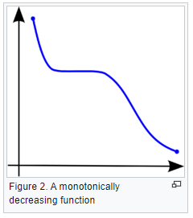

# Linear Regression

## Pearson R vs Spearman Rho?

- Correlation is the degree to which two variables are linearly related. 
- Important to remember that correlation doesn't imply causation.
- Pearson's R ranges from +1 to -1
- Spearman's rank correlation coefficient is a nonparametric measure of rank correlation
    - Spearman's rho explains how well two variables can be described using a montonic function

### What is a montonic relationship?

"A monotonic relationship is a relationship that does one of the following:

(1) as the value of one variable increases, so does the value of the other variable, OR,

(2) as the value of one variable increases, the other variable value decreases.

BUT, not exactly at a constant rate whereas in a linear relationship the rate of increase/decrease is constant."

#### Example of Monotonic Relationship

## References

1. https://towardsdatascience.com/clearly-explained-pearson-v-s-spearman-correlation-coefficient-ada2f473b8

2. https://www.youtube.com/watch?v=LSmjQNsCbFs&ab_channel=SpencerPao

3. 